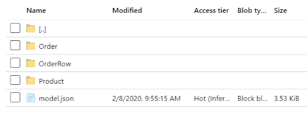
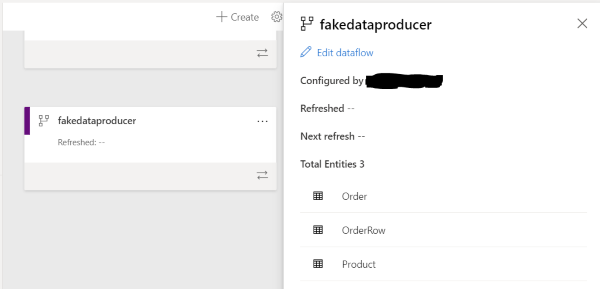
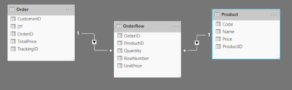
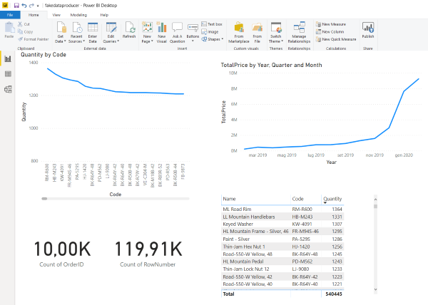

# Fake Data Producer

The app creates fake data in a Azure Data Lake storage, following CDM standard.  
https://docs.microsoft.com/en-us/common-data-model/  
https://docs.microsoft.com/en-us/common-data-model/data-lake  
It creates locally defined entities ("custom entities"), i.e. the app does not use Microsoft defined standard CDM entities.
The corresponding model.json follows specification from the standard:  
https://docs.microsoft.com/en-us/common-data-model/model-json


### Configuration
The application reads 2 configuration files: appsettings.json and appsettings.local.json  
The latter is excluded from GIT through .gitignore

Entries:
```
  "numberOfOrders": 500,
  "ordersCutOff": 1000,
  "minRowsPerOrder": 5,
  "maxRowsPerOrder": 20,
  "ordersRowsCutOff": 1000,
  "DumpToLocalFile": true,
  "UploadToADLSGen2": true,
  "ADLSaccountName": "storageaccountname",
  "ADLSaccountKey": "key...",
  "ADLSfileSystemName": "demo",
  "ADLSworkingFolder": "fake/fakedataproducer"
```

### Results

The result on Azure Data Lake:  


The model.json can be directly mapped to a PowerBI service DataFlow using the full URL:
https://storageaccount.dfs.name/filesystem/fakedataproducer/model.json



The resulting Dataflow can be imported and used in Power BI Desktop and service:  

  

  

### model.json output example


```json
{
  "name": "mydata",
  "version": "1.0",
  "modifiedTime": "2020-02-08T08:55:13.2545137+00:00",
  "entities": [
    {
      "name": "Product",
      "$type": "LocalEntity",
      "description": "Product",
      "attributes": [
        {
          "name": "ProductID",
          "dataType": "int64"
        },
        {
          "name": "Name",
          "dataType": "string"
        },
        {
          "name": "Code",
          "dataType": "string"
        },
        {
          "name": "Price",
          "dataType": "double"
        }
      ],
      "partitions": [
        {
          "name": "P_0",
          "refreshTime": "2020-02-08T08:55:13.2631694+00:00",
          "location": "https://storageaccount/filesystem/fakedataproducer/Product/Product_0.csv"
        }
      ]
    },
    {
      "name": "Order",
      "$type": "LocalEntity",
      "description": "Order",
      "attributes": [
        {
          "name": "OrderID",
          "dataType": "string"
        },
        {
          "name": "CustomerID",
          "dataType": "string"
        },
        {
          "name": "TrackingID",
          "dataType": "string"
        },
        {
          "name": "DT",
          "dataType": "dateTime"
        },
        {
          "name": "TotalPrice",
          "dataType": "decimal"
        }
      ],
      "partitions": [
        {
          "name": "P_0",
          "refreshTime": "2020-02-08T08:55:13.2634949+00:00",
          "location": "https://storageaccount/filesystem/fakedataproducer/Order/Order_0.csv"
        },
        {
          "name": "P_1",
          "refreshTime": "2020-02-08T08:55:13.2634982+00:00",
          "location": "https://storageaccount/filesystem/fakedataproducer/Order/Order_1.csv"
        }
      ]
    },
    {
      "name": "OrderRow",
      "$type": "LocalEntity",
      "description": "OrderRow",
      "attributes": [
        {
          "name": "OrderID",
          "dataType": "string"
        },
        {
          "name": "RowNumber",
          "dataType": "int64"
        },
        {
          "name": "ProductID",
          "dataType": "int64"
        },
        {
          "name": "Quantity",
          "dataType": "int64"
        },
        {
          "name": "UnitPrice",
          "dataType": "decimal"
        }
      ],
      "partitions": [
        {
          "name": "P_0",
          "refreshTime": "2020-02-08T08:55:13.263508+00:00",
          "location": "https://storageaccount/filesystem/fakedataproducer/OrderRow/OrderRow_0.csv"
        },
        {
          "name": "P_1",
          "refreshTime": "2020-02-08T08:55:13.2635085+00:00",
          "location": "https://storageaccount/filesystem/fakedataproducer/OrderRow/OrderRow_1.csv"
        }
      ]
    }
  ],
  "relationships": [
    {
      "$type": "SingleKeyRelationship",
      "fromAttribute": {
        "entityName": "Order",
        "attributeName": "OrderID"
      },
      "toAttribute": {
        "entityName": "OrderRow",
        "attributeName": "OrderID"
      }
    },
    {
      "$type": "SingleKeyRelationship",
      "fromAttribute": {
        "entityName": "Product",
        "attributeName": "ProductID"
      },
      "toAttribute": {
        "entityName": "OrderRow",
        "attributeName": "ProductID"
      }
    }
  ]
}
```

